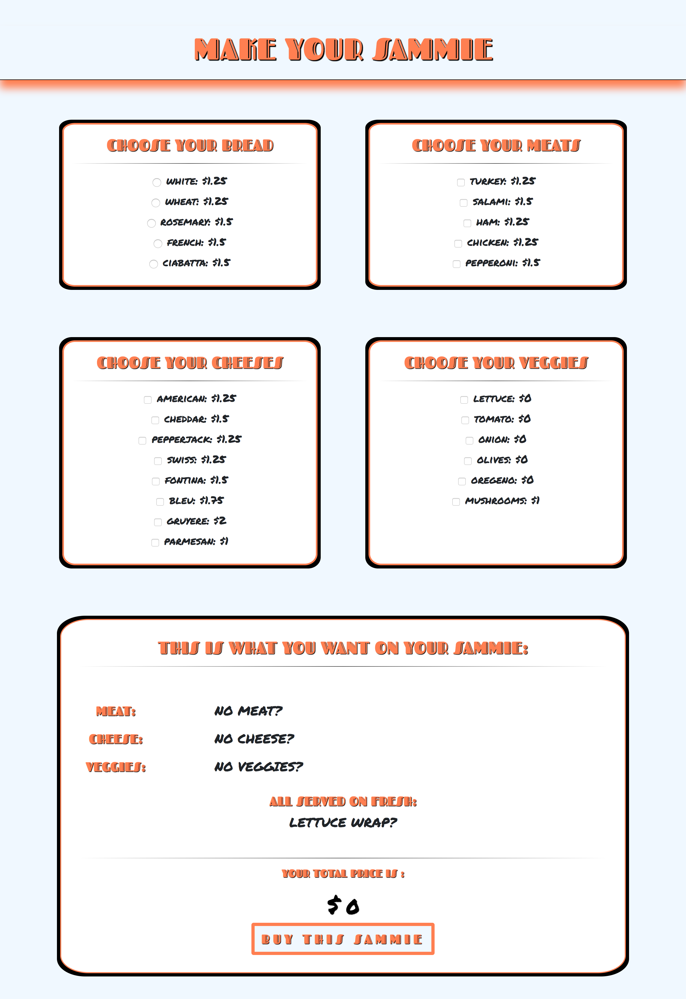
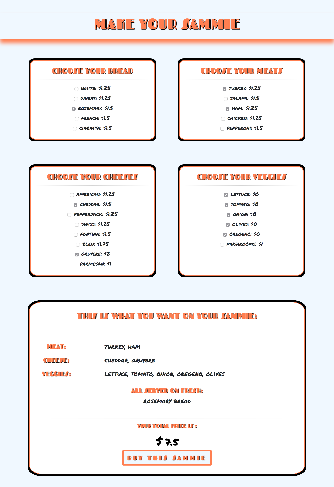
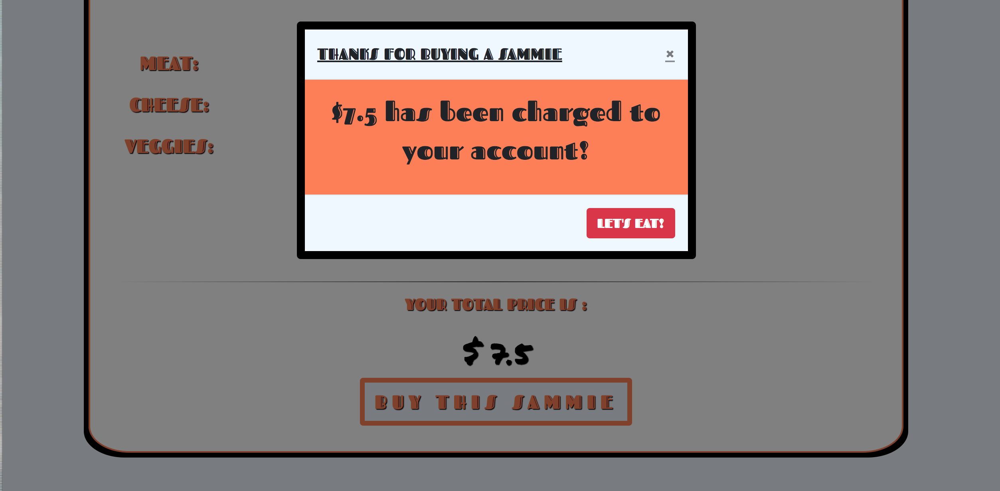
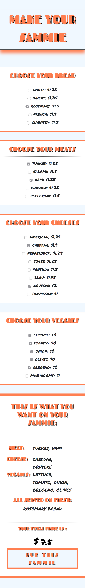

# Sammie Maker

## Description
A sandwich ordering page that lets you select/unselect ingredients and tells you the price of your sandwich in real time.

## Screenshots
Here is page load:

Here is when you fill out what you want:

Here is the module that pops up when you complete your order:

Created with a mobile first approach, looks great on small screens:

## Tech Used
* HTML
* CSS
* Javascript 
* BootStrap

## How To Run
1. Go to: `https://www.npmjs.com/package/http-server` and install "http-server".  
2. Navigate to the project folder in command line interface and type: `http-server -p 8080`  
3. This will show at: `http://localhost:8080` in your internet browser.